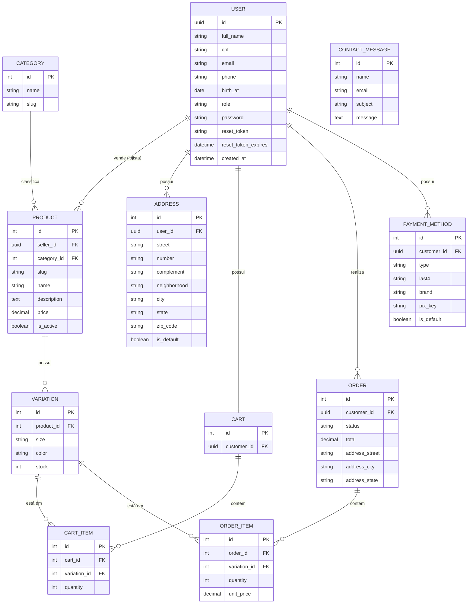

# New Style API


API REST para uma plataforma de e-commerce de roupas, desenvolvida como parte do **Desafio de Projetos — Trainee Dev Backend** da [EJECT](https://ejectufrn.com.br) (Empresa Júnior da Escola de Ciências e Tecnologia da UFRN).

---

## Sobre o projeto

### Objetivo

Simular a construção de uma API REST para um serviço de e-commerce, permitindo que **lojistas** cadastrem e gerenciem produtos, e que **clientes** naveguem pelo catálogo, montem um carrinho e finalizem pedidos.

### Funcionalidades por ator

**Cliente**

- Cadastro, login e recuperação de senha (JWT)
- Navegação e busca de produtos com filtros combináveis (categoria, preço, tamanho, cor)
- Gerenciamento de carrinho (adicionar, atualizar, remover itens)
- Finalização de pedidos, com validação e atualização automática de estoque
- Acompanhamento de pedidos próprios
- Cadastro e remoção de métodos de pagamento (cartão e PIX)
- Envio de mensagens de contato

**Lojista**

- Cadastro, edição, ativação/desativação e remoção de produtos
- Gerenciamento de variações (tamanho/cor) e estoque
- Listagem de todos os pedidos, com filtro por status
- Atualização do status dos pedidos seguindo um fluxo válido

**Admin**

- Atualização do papel (role) de usuários (`customer` ↔ `seller`)

### Estrutura do projeto

```bash
new-style-api/
├── store/          # configurações do projeto (settings, urls raiz)
├── users/          # cadastro, autenticação, endereços e roles
├── products/       # categorias, produtos, variações e estoque
├── orders/         # carrinho e pedidos
├── payments/       # métodos de pagamento
├── contact/        # formulário de contato
├── manage.py
├── requirements.txt
└── .env            # não versionado
```

---

## Modelagem



> O `ORDER` armazena uma cópia (*snapshot*) do endereço de entrega no momento da compra, e o `ORDER_ITEM` armazena o preço unitário no momento da compra — assim alterações futuras no endereço ou no preço do produto não afetam pedidos já realizados.

---

## Instalação e execução

### Pré-requisitos

- Python 3.11+
- pip

### Passo a passo

**1. Clone o repositório**

```bash
git clone <url-do-repositorio>
cd new-style-api
```

**2. Crie e ative o ambiente virtual**

```bash
python -m venv venv

# Windows
venv\Scripts\activate

# Linux/Mac
source venv/bin/activate
```

**3. Instale as dependências**

```bash
pip install -r requirements.txt
```

**4. Configure as variáveis de ambiente**

Crie um arquivo `.env` na raiz do projeto:

```env
SECRET_KEY=sua-chave-secreta-aqui
DEBUG=True
ALLOWED_HOSTS=127.0.0.1,localhost

CONTACT_EMAIL=suporte@newstyle.com
EMAIL_FROM=noreply@newstyle.com

# necessário apenas em produção (DEBUG=False)
SENDGRID_API_KEY=sua-chave-sendgrid
```

**5. Execute as migrations**

```bash
python manage.py migrate
```

**6. (Opcional) Crie um superusuário**

```bash
python manage.py createsuperuser
```

**7. Inicie o servidor**

```bash
python manage.py runserver
```

A API estará disponível em `http://127.0.0.1:8000/`

### Rodando os testes

```bash
python manage.py test
```

---

## Dependências

| Biblioteca | Finalidade |
|---|---|
| Django | Framework principal |
| djangorestframework | Construção da API REST |
| djangorestframework-simplejwt | Autenticação via JWT |
| django-filter | Filtros combináveis nos endpoints de listagem |
| django-autoslug | Geração automática de slugs para produtos |
| django-anymail | Envio de e-mail via SendGrid em produção |
| python-dotenv | Carregamento de variáveis de ambiente |

> As versões exatas de cada biblioteca estão fixadas no [`requirements.txt`](./requirements.txt).

---

## Documentação da API

A documentação interativa (Swagger) está disponível em:

- Local: `http://127.0.0.1:8000/api/docs/`
- Redoc (alternativa): `http://127.0.0.1:8000/api/redoc/`
- **Produção**: `https://LeonAlves.pythonanywhere.com/api/docs/`

Nela você encontra a descrição de cada endpoint, parâmetros aceitos e exemplos de payload para requisições e respostas.

### Principais grupos de endpoints

| Grupo | Prefixo | Descrição |
|---|---|---|
| Autenticação | `/auth/` | Cadastro, login, refresh de token, recuperação de senha |
| Produtos | `/products/` | CRUD de produtos, variações e filtros de busca |
| Carrinho | `/cart/` | Gerenciamento de itens do carrinho |
| Pedidos | `/orders/` | Criação, consulta e atualização de status de pedidos |
| Pagamentos | `/payments/` | CRUD de métodos de pagamento |
| Contato | `/contact/` | Envio de mensagens de contato |

Para detalhes completos de cada rota, consulte o Swagger.

---

## Sobre o desafio

Projeto desenvolvido para o **Desafio de Projetos — Trainee Dev Backend** da EJECT (Empresa Júnior da Escola de Ciências e Tecnologia, UFRN).

> "Transformar por meio de microrrevoluções pessoas em protagonistas do empreendedorismo" — Missão EJECT
